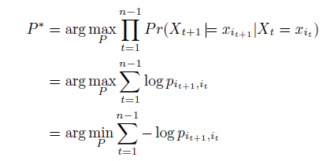

# Markov chains to predict optimum career path 

This is a notebook showcasing the application of Markov chains in HR as follows:

We view a career path as a sequence of multiple nodes/positions:  (X1, X2, X3, …Xn) using the transitions occurred in the past. Given a person’s current position and his/her goal, we try to discover the optimal career path, that is, the path that has the highest probability to reach the goal node.

We model a career path as a Markov chain:

The next state depends only on current state: 

P(Xt = xt | Xt-1 = xt-1, …X1=x1) = P(Xt = xt | Xt-1 = xt-1)

Time-homogeneous Markov chain, the process is described by a single time-independent transition matrix p:
         
         pij = Pr(Xt = j | Xt-1 = i)

Shortest path

We want to predict the optimal path P* = xi1 , xi2 , … , xin



Use a graph with states (positions) as vertices and       as        weight on edges
Solving the problem is equivalent to finding a shortest path between a single source and a single destination on directed graph
The problem can be solved using Dijkstra’s algorithm


This is a [Streamlit](https://streamlit.io/) application showcasing an interactive map that allows searching for touristic places accross a certain region. 
The virtual assistant modeule is a [RAG](https://www.pinecone.io/learn/retrieval-augmented-generation/) application using a Pinecone index previously created to serve the OpenAI API with content about each place. The application is used on [www.nature-quebec.com](https://www.nature-quebec.com/carte.html) website, property of lapetitefleur company.

## Table of Contents

- [Getting Started](#getting-started)
- [Prerequisites](#prerequisites)
- [Installation](#installation)
- [Usage](#usage)
- [Contributing](#contributing)
- [License](#license)

## Getting Started

Install streamlit as explained on the [official website](https://docs.streamlit.io/library/get-started/installation).

## Prerequisites

- Your favorite IDE or text editor
- Python 3.8 - Python 3.11
- PIP
- Pinecone index previously created
- OpenAI API

## Installation

```bash
# Clone the repository
git clone https://github.com/madelinap/lapetitefleur.git

# Change the directory
cd lapetitefleur

# Create a virtual environment (optional but recommended)
python -m venv venv

# Activate the virtual environment (Windows)
venv\Scripts\activate

# Activate the virtual environment (macOS and Linux)
source venv/bin/activate

# Install dependencies
pip install -r requirements.txt

```
## Usage

```bash
streamlit run lapetitefleur.py
```

## Contributing

We welcome contributions from the community. If you'd like to contribute to this project, please follow these guidelines:

1. Fork the repository.
2. Create a new branch for your feature or bug fix.
3. Make your changes and commit them.
4. Create a pull request with a clear description of the changes and their purpose.


## License
This project is licensed under the lapetitefleur License - see the LICENSE file for details.

